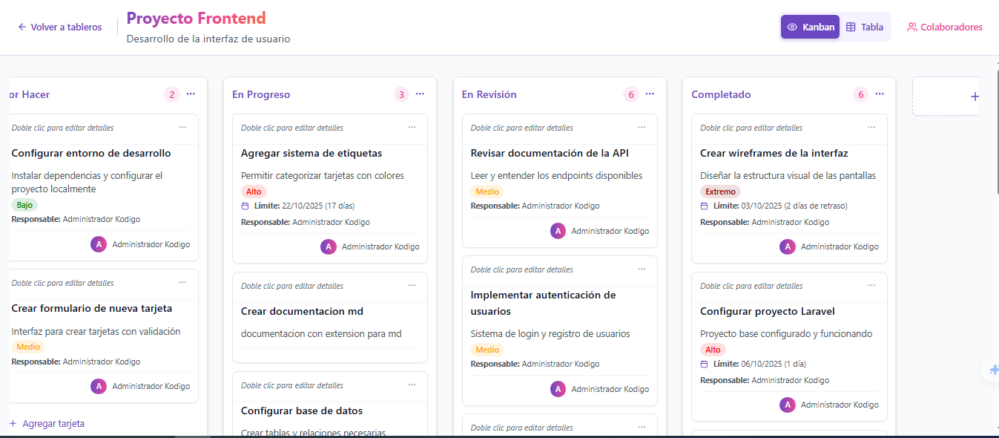
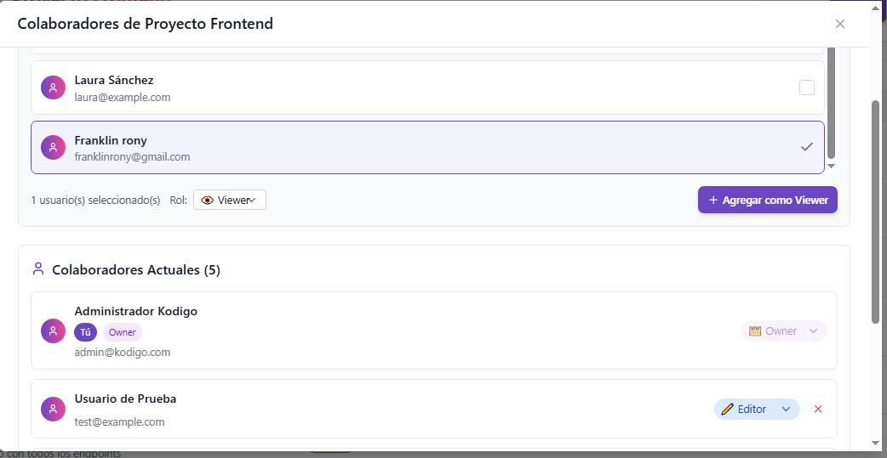
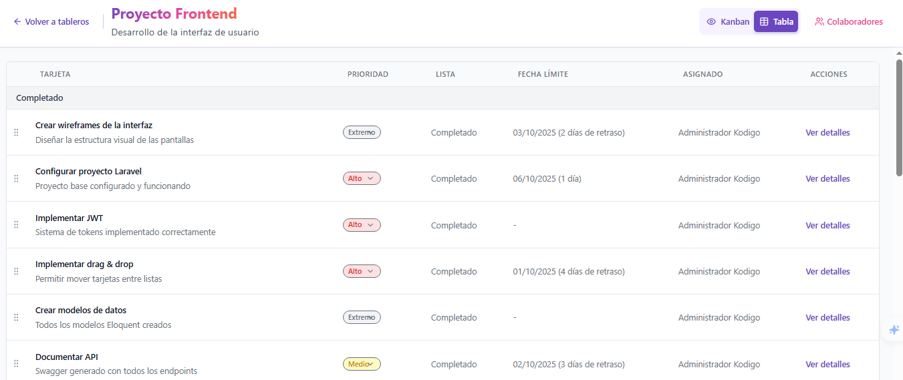
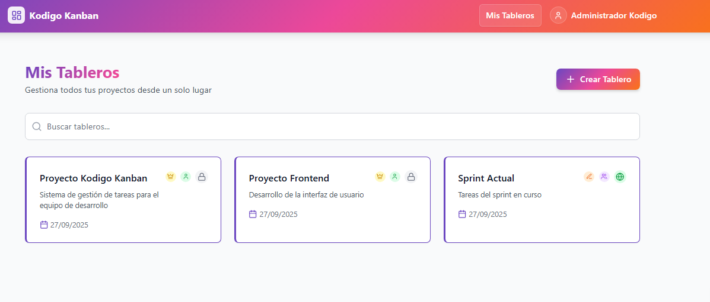

# Kodigo Kanban (frontend)

Proyecto frontend de la aplicación Kodigo Kanban.

Repositorio  (frontend): https://github.com/franklinrony/kodigo-reservaciones-fronend

Repositorio backend (API): https://github.com/franklinrony/kodigo-reservaciones-backend

## Resumen

Kodigo Kanban es una interfaz React + TypeScript para gestionar tableros Kanban y tables con soporte de colaboradores, etiquetas, comentarios y gestión de tarjetas. Esta app se integra con una API REST (Laravel en el backend) y usa Vite para el desarrollo local.

## Tecnologías

- React 18
- TypeScript
- Vite
- TailwindCSS
- Lucide Icons
- Axios (a través de `apiClient` en el proyecto)
- Estructura basada en componentes (src/components)

## Características principales

- Vista Kanban y vista Tabla
- Gestión de tableros, listas y tarjetas
- Colaboradores por tablero (agregar, cambiar rol, remover)
- Etiquetas (labels) por tablero
- Modal de edición/preview de tarjetas
- Contextos para Auth, Sync y permisos
- Carga optimizada con skeletons y estados de loading

## Requisitos

- Node.js >= 18
- npm (o yarn/pnpm si prefieres)
- Backend de la API disponible (por defecto el frontend apunta a las variables de entorno listadas en `.env`)

## Clonar el repositorio

Abre una terminal y ejecuta:

```bash
git clone https://github.com/franklinrony/kodigo-reservaciones-fronend.git
cd kodigo-reservaciones-fronend
```

## Configurar variables de entorno

Copia el archivo de ejemplo `.env` (si existe) o crea un `.env` en la raíz con las siguientes variables mínimas usadas por la app:

```properties
# API Configuration
VITE_API_BASE_URL=http://192.168.1.28:8000
VITE_AUTH_BASE_URL=/api/auth
VITE_API_V1_BASE_URL=/api/v1
```

Ajusta `VITE_API_BASE_URL` a la URL donde corre tu backend (por ejemplo `http://localhost:8000` en desarrollo local).

> Nota: Vite expone variables que empiezan con `VITE_` a la app cliente. Si cambias las variables, reinicia el servidor de desarrollo.

## Instalación de dependencias

En la carpeta del proyecto ejecuta:

```bash
npm install
```

## Ejecutar en modo desarrollo

Inicia el servidor de desarrollo (Vite):

```bash
npm run dev
```

Esto arrancará la app y mostrará la URL local (por defecto http://localhost:5173 o el siguiente puerto disponible). Abre esa URL en el navegador.

Si necesitas forzar el host para acceso desde otras máquinas en la red local, puedes usar `--host` o configurar en `package.json`/`vite.config.ts`.

## Construir para producción

```bash
npm run build
```

Previsualizar build de producción localmente:

```bash
npm run preview
```

## Notas de desarrollo

- El código de UI está en `src/components`.
- Páginas principales en `src/pages`.
- Servicios que consumen la API están en `src/services` (`authService`, `boardService`, `labelService`, `userService`, etc.).
- Contextos: `src/contexts` (AuthContext, SyncContext, BoardPermissionsContext...)
- Hooks reutilizables: `src/hooks` (`useBoard`, `useBoards`, `useAuth`, `useBoardPermissions`, etc.)

## UX / Accesibilidad

- La app usa skeletons y loaders para estados de carga.
- Los botones tienen `title` y `aria-busy` cuando procede para mejorar la accesibilidad.

## Problemas comunes y soluciones rápidas

- Si no ves cambios después de editar ficheros:
  - Asegúrate que el servidor dev de Vite está corriendo y revisa la terminal para HMR.
  - Fuerza recarga completa en el navegador (Ctrl+F5) para evitar cache.
- Errores de CORS/401 desde el backend:
  - Verifica que `VITE_API_BASE_URL` apunta al backend correcto.
  - Revisa tokens en `localStorage` (la app utiliza `authService` para manejar token local).

## Capturas

Imágenes de ejemplo de la interfaz:







